# Real-Time Translation System with Advanced AI Architecture

## Overview

The Real-Time Translation System is a production-ready, scalable application for real-time speech translation with advanced AI capabilities. Built with a modern microservices architecture, it provides seamless translation experiences through multiple interfaces including REST APIs, WebSocket connections, and web-based UIs. The system leverages Google Gemini AI for translation and supports real-time audio processing through WhisperLive integration.

## System Architecture

### High-Level Architecture


### Component Architecture


### Data Flow Architecture


## Key Features

### **Advanced Translation Engine**
- **Context-Aware Translation**: Maintains conversation history and adapts to context
- **Domain Detection**: Automatically detects and adapts to business, technical, medical, legal, and educational content
- **Cultural Sensitivity**: Bengali and Hindi cultural context with proper honorifics and regional variations
- **Quality Assessment**: Real-time translation quality scoring and iterative improvements
- **Multi-Stage Pipeline**: Pre-processing, translation, post-processing, and quality validation
- **Terminology Consistency**: Maintains consistent translation of technical terms across sessions

### **Real-Time Processing**
- **WhisperLive Integration**: Live speech-to-text transcription with voice activity detection
- **Live Camera Feed**: Real-time webcam integration for immersive translation experience
- **Streaming Translation**: Instant translation display as you speak
- **Session Management**: Complete session recording with transcript generation

### **Intelligent Features**
- **Metacognitive Controller**: Adaptive strategy selection based on content type
- **EgoSchema Integration**: Advanced video understanding and evaluation
- **Performance Monitoring**: Real-time system performance tracking and optimization
- **Topic Analysis**: Course material comparison against live transcripts

### **Production-Ready Architecture**
- **Robust Error Handling**: Automatic reconnection and graceful degradation
- **Scalable Design**: Modular architecture with microservices support
- **Monitoring & Logging**: Comprehensive system monitoring with Prometheus/Grafana
- **Deployment Options**: Docker, Kubernetes, and cloud platform support

## API Documentation

### Core API Endpoints

The system provides a comprehensive REST API for all translation and management operations:

#### Health Check Endpoints
```http
GET /health
GET /api/health
```
**Purpose**: System health monitoring  
**Response**: JSON with service status and version information  
**Usage**: Load balancer health checks, monitoring systems

#### Translation API
```http
POST /api/translate
Content-Type: application/json

{
  "text": "Hello, how are you?",
  "target_language": "bn",
  "session_id": "optional-session-id"
}
```
**Purpose**: Translate text using Google Gemini AI  
**Response**: Translation result with quality metrics  
**Features**: Session tracking, quality assessment, latency metrics

#### Session Management
```http
GET /api/sessions              # List all active sessions
GET /api/sessions/{id}/stats   # Get session statistics
DELETE /api/sessions/{id}      # Delete session
```
**Purpose**: Manage translation sessions and track usage

#### Schema Management
```http
GET /api/schemas               # List available schemas
POST /api/schemas              # Upload new schema
GET /api/schemas/{id}          # Get specific schema
DELETE /api/schemas/{id}       # Delete schema
```
**Purpose**: Manage translation schemas and validation rules

#### Processing API
```http
POST /api/process
Content-Type: application/json

{
  "session_id": "session-123",
  "schema_id": "schema-456",
  "transcript": "optional-transcript-text"
}
```
**Purpose**: Process sessions against defined schemas

#### Reporting API
```http
GET /api/reports               # Get processing reports
```
**Purpose**: Analytics and usage reporting

### WebSocket API

For real-time communication and live translation:

```javascript
// Connection
const socket = io('http://localhost:5001');

// Events
socket.emit('start_translation', {
  session_id: 'session-123',
  target_language: 'bn'
});

socket.emit('audio_chunk', audioData);

socket.on('transcription_result', (data) => {
  console.log('Transcription:', data.transcription);
  console.log('Translation:', data.translation);
});
```

## Deployment Architecture

### Development Environment

```
┌─────────────────────────────────────────────────────────────────┐
│                    DEVELOPMENT SETUP                           │
├─────────────────────────────────────────────────────────────────┤
│                                                                 │
│  Local Machine                                                  │
│  ├─ Python Virtual Environment                                  │
│  ├─ Flask Development Server (:5000)                           │
│  ├─ Redis Server (:6379)                                       │
│  ├─ WhisperLive Server (:9090)                                 │
│  └─ Gradio UI (:7860)                                          │
│                                                                 │
│  Development Tools:                                             │
│  ├─ Hot reloading                                               │
│  ├─ Debug mode                                                  │
│  ├─ Comprehensive logging                                       │
│  └─ API testing tools                                           │
│                                                                 │
└─────────────────────────────────────────────────────────────────┘
```

### Production Environment

```
┌─────────────────────────────────────────────────────────────────┐
│                    PRODUCTION DEPLOYMENT                       │
├─────────────────────────────────────────────────────────────────┤
│                                                                 │
│  ┌─────────────────────────────────────────────────────────┐   │
│  │                  LOAD BALANCER                         │   │
│  │              (Nginx / Cloud LB)                        │   │
│  │                   :80 / :443                           │   │
│  └─────────────────┬───────────────────────────────────────┘   │
│                    │                                           │
│                    ▼                                           │
│  ┌─────────────────────────────────────────────────────────┐   │
│  │              APPLICATION TIER                           │   │
│  │  ┌─────────────┐  ┌─────────────┐  ┌─────────────┐    │   │
│  │  │   Flask     │  │   Flask     │  │   Flask     │    │   │
│  │  │    App      │  │    App      │  │    App      │    │   │
│  │  │ (Gunicorn)  │  │ (Gunicorn)  │  │ (Gunicorn)  │    │   │
│  │  │   :5001     │  │   :5002     │  │   :5003     │    │   │
│  │  └─────────────┘  └─────────────┘  └─────────────┘    │   │
│  └─────────────────────────────────────────────────────────┘   │
│                    │                                           │
│                    ▼                                           │
│  ┌─────────────────────────────────────────────────────────┐   │
│  │                 DATA TIER                               │   │
│  │  ┌─────────────┐  ┌─────────────┐  ┌─────────────┐    │   │
│  │  │    Redis    │  │    File     │  │  External   │    │   │
│  │  │   Cluster   │  │   Storage   │  │   Services  │    │   │
│  │  │   :6379     │  │             │  │             │    │   │
│  │  │             │  │ • Schemas   │  │ • Google    │    │   │
│  │  │ • Sessions  │  │ • Uploads   │  │   Gemini    │    │   │
│  │  │ • Cache     │  │ • Logs      │  │ • Whisper   │    │   │
│  │  └─────────────┘  └─────────────┘  └─────────────┘    │   │
│  └─────────────────────────────────────────────────────────┘   │
│                                                                 │
└─────────────────────────────────────────────────────────────────┘
```

### Container Deployment

```mermaid
graph TB
    subgraph "Docker Compose Production Stack"
        subgraph "docker-compose.prod.yml"
            A[nginx<br/>Load Balancer<br/>Ports: 80, 443<br/>Volumes: ./ssl-certs]
            
            B[flask-app<br/>Python Application<br/>Port: 5001<br/>Environment: production<br/>Volumes: ./data, ./config]
            
            C[redis<br/>Session Storage<br/>Port: 6379<br/>Volumes: ./data/redis]
            
            D[prometheus<br/>Metrics Collection<br/>Port: 9090<br/>Config: ./monitoring/prometheus.yml]
            
            E[grafana<br/>Metrics Dashboard<br/>Port: 3000<br/>Datasources: Prometheus]
        end
    end
    
    subgraph "External Access"
        F[External Clients<br/>:80 / :443]
    end
    
    subgraph "Data Persistence"
        G[./data/<br/>Application Data]
        H[./ssl-certs/<br/>SSL Certificates]
        I[./monitoring/<br/>Config Files]
    end
    
    F --> A
    A --> B
    B --> C
    B --> D
    D --> E
    
    B --> G
    A --> H
    D --> I
    C --> G
    
    style A fill:#e3f2fd
    style B fill:#e8f5e8
    style C fill:#fff3e0
    style D fill:#fce4ec
    style E fill:#f3e5f5
    style F fill:#e0f2f1
    style G fill:#f9f9f9
    style H fill:#f9f9f9
    style I fill:#f9f9f9
```



### Cloud Deployment Options

#### AWS Deployment
```
┌─── Application Load Balancer (ALB)
├─── ECS Fargate / EKS Cluster
│    ├─── Flask Application Containers
│    ├─── Redis ElastiCache
│    └─── CloudWatch Logging
├─── RDS / DynamoDB (Optional)
├─── S3 for File Storage
└─── Route 53 for DNS
```

#### Google Cloud Deployment
```
┌─── Cloud Load Balancing
├─── Google Kubernetes Engine (GKE)
│    ├─── Flask Application Pods
│    ├─── Cloud Memorystore (Redis)
│    └─── Cloud Logging
├─── Cloud SQL (Optional)
├─── Cloud Storage
└─── Cloud DNS
```

#### Azure Deployment
```
┌─── Azure Load Balancer
├─── Azure Kubernetes Service (AKS)
│    ├─── Flask Application Containers
│    ├─── Azure Cache for Redis
│    └─── Azure Monitor
├─── Azure Database (Optional)
├─── Azure Blob Storage
└─── Azure DNS
```

## How It Works: Complete System Flow

### 1. System Initialization
```
┌─────────────────────────────────────────────────────────────────┐
│                 APPLICATION STARTUP                             │
├─────────────────────────────────────────────────────────────────┤
│                                                                 │
│  1. Load Configuration                                          │
│     ├─ Environment variables (.env)                             │
│     ├─ Google Gemini API key                                    │
│     └─ Redis connection settings                                │
│                                                                 │
│  2. Initialize Flask Application                                │
│     ├─ Register API blueprints                                  │
│     ├─ Setup CORS policies                                      │
│     ├─ Configure WebSocket support                              │
│     └─ Initialize service layer                                 │
│                                                                 │
│  3. Start Background Services                                   │
│     ├─ Redis connection pool                                    │
│     ├─ WebSocket event handlers                                 │
│     └─ Health check endpoints                                   │
│                                                                 │
└─────────────────────────────────────────────────────────────────┘
```

### 2. Translation Request Flow
```
┌─────────────────────────────────────────────────────────────────┐
│                  TRANSLATION PIPELINE                          │
├─────────────────────────────────────────────────────────────────┤
│                                                                 │
│  1. Request Reception                                           │
│     ├─ API endpoint validation                                  │
│     ├─ Input sanitization                                       │
│     └─ Session ID generation                                    │
│                                                                 │
│  2. Translation Processing                                      │
│     ├─ Google Gemini API call                                   │
│     ├─ Context-aware prompt generation                          │
│     ├─ Cultural adaptation rules                                │
│     └─ Quality assessment metrics                               │
│                                                                 │
│  3. Session Management                                          │
│     ├─ Redis cache update                                       │
│     ├─ Performance metrics logging                              │
│     └─ History tracking                                         │
│                                                                 │
│  4. Response Formatting                                         │
│     ├─ JSON structure preparation                               │
│     ├─ Metadata inclusion                                       │
│     └─ Error handling                                           │
│                                                                 │
└─────────────────────────────────────────────────────────────────┘
```

### 3. Real-Time Communication Flow
```
┌─────────────────────────────────────────────────────────────────┐
│                  WEBSOCKET PIPELINE                            │
├─────────────────────────────────────────────────────────────────┤
│                                                                 │
│  1. WebSocket Connection                                        │
│     ├─ Client authentication                                    │
│     ├─ Session room assignment                                  │
│     └─ Event handler registration                               │
│                                                                 │
│  2. Audio Processing                                            │
│     ├─ Audio chunk reception                                    │
│     ├─ WhisperLive transcription                                │
│     ├─ Real-time translation                                    │
│     └─ Result broadcasting                                      │
│                                                                 │
│  3. Session Broadcasting                                        │
│     ├─ Multi-client synchronization                             │
│     ├─ Event distribution                                       │
│     └─ Connection management                                    │
│                                                                 │
└─────────────────────────────────────────────────────────────────┘
```

## Directory Structure

For detailed information, refer to the [Project Structure Documentation](docs/PROJECT_STRUCTURE.md).

## Getting Started

### Prerequisites

- Python 3.8+
- Docker & Docker Compose
- Google Gemini API key

### Development Setup

1. **Clone the Repository**:
    ```bash
git clone https://github.com/Luciferai04/finalmeet1.git
cd finalmeet1
    ```

2. **Install Dependencies**:
    ```bash
    pip install -r requirements.txt
    ```

3. **Install WhisperLive**:
    ```bash
    # Install WhisperLive from GitHub
    pip install git+https://github.com/collabora/WhisperLive.git
    
    # Or clone and install locally
    git clone https://github.com/collabora/WhisperLive.git
    cd WhisperLive
    pip install -e .
    cd ..
    ```

4. **Configure Environment**:
    ```bash
    # Copy example environment file
    cp config/environments/development.env.example config/environments/development.env
    
    # Edit the file and add your Google API key
    export GOOGLE_API_KEY="your-google-gemini-api-key-here"
    ```

5. **Run the Application**:
    ```bash
    python main.py
    ```

### Running the Gradio UI

1. **Start WhisperLive Server**:
    ```bash
    # In a separate terminal, start the WhisperLive server
    python -m whisper_live.server --port 9090
    
    # Or if you cloned WhisperLive locally:
    cd WhisperLive
    python run_server.py --port 9090
    cd ..
    ```

2. **Optional: Start Redis** (for advanced features):
    ```bash
    redis-server
    ```

3. **Launch the UI**:
    ```bash
    python run_ui.py
    ```
    
    The interface will be available at: `http://localhost:7860`

### Configuration

- Configuration is managed via environment variables and dotenv files located in `config/environments/`.
- Copy the example files and customize them:
  ```bash
  # Development configuration
  cp config/environments/development.env.example config/environments/development.env
  
  # Production configuration  
  cp config/environments/production.env.example config/environments/production.env
  ```
- **Required**: Set your Google Gemini API key in the environment file or as an environment variable.
- For SSL/HTTPS setup, see `config/ssl/README.md` for certificate placement instructions.

### Deployment

We provide several methods for deployment, including Docker and direct server deployment with Gunicorn.

- **Docker**:
    ```bash
    docker-compose -f deploy/docker/docker-compose.prod.yml up --build
    ```

- **Gunicorn**:
    ```bash
    gunicorn --config config/gunicorn.conf.py wsgi:app
    ```

For more information, please refer to the [Deployment Guide](docs/DEPLOYMENT.md).

## Security Practices

- All sensitive data is stored securely using environment variables.
- SSL/TLS is enabled for secure communication.
- Input validation and sanitization are enforced on all endpoints.
- Rate limiting is applied to API requests to protect against abuse.

## How to Use the System

### For End Users

#### 1. Using the Web Interface (Gradio)
```
1. Navigate to http://localhost:7860
2. Select source and target languages
3. Choose input method:
   - Text input for direct translation
   - Microphone for real-time speech translation
   - File upload for document translation
4. Start translation session
5. View results in real-time with quality metrics
```

#### 2. Using REST API
```bash
# Translate text
curl -X POST http://localhost:5001/api/translate \
  -H "Content-Type: application/json" \
  -d '{
    "text": "Hello, how are you today?",
    "target_language": "bn"
  }'

# Get session information
curl http://localhost:5001/api/sessions

# Check system health
curl http://localhost:5001/health
```

#### 3. Using WebSocket for Real-Time
```javascript
// Connect to WebSocket
const socket = io('http://localhost:5001');

// Start translation session
socket.emit('start_translation', {
  target_language: 'bn',
  session_id: 'my-session'
});

// Send audio chunks
socket.emit('audio_chunk', audioData);

// Receive translations
socket.on('transcription_result', (data) => {
  console.log('Original:', data.transcription);
  console.log('Translation:', data.translation);
});
```

### For Developers

#### 1. Extending the Translation Service
```python
# Add custom translation logic
class CustomTranslationService(TranslationService):
    def custom_translate(self, text, context):
        # Add domain-specific logic
        enhanced_prompt = self._add_context(text, context)
        return super().translate(enhanced_prompt)
```

#### 2. Creating Custom Schemas
```python
# Define translation schemas for specific domains
schema = {
    "domain": "medical",
    "terminology": {
        "doctor": "ডাক্তার",
        "medicine": "ওষুধ"
    },
    "context_rules": [
        "Use formal language",
        "Maintain medical accuracy"
    ]
}
```

#### 3. Integrating with External Systems
```python
# Integration example
import requests

def translate_and_save(text, target_lang, user_id):
    # Translate text
    response = requests.post('http://localhost:5001/api/translate', 
        json={'text': text, 'target_language': target_lang})
    
    # Save to database
    translation = response.json()['data']['translated_text']
    save_to_database(user_id, text, translation)
    
    return translation
```

## Performance Optimization

### System Tuning

```bash
# Optimize Gunicorn workers
gunicorn --workers 4 --worker-class gevent --worker-connections 100 wsgi:app

# Configure Redis for better performance
redis-server --maxmemory 1gb --maxmemory-policy allkeys-lru

# Enable monitoring
export PROMETHEUS_METRICS=true
export LOG_LEVEL=INFO
```

### Scaling Guidelines

| Load Level | Configuration | Resources |
|------------|---------------|----------|
| Light (1-10 users) | 1 worker, 1GB RAM | Single instance |
| Medium (10-100 users) | 4 workers, 4GB RAM | Load balancer + 2 instances |
| Heavy (100+ users) | 8+ workers, 8GB+ RAM | Auto-scaling cluster |

## Monitoring and Maintenance

### System Monitoring

```bash
# Check system status
curl http://localhost:5001/health

# Monitor API performance
curl http://localhost:5001/api/health

# Check Redis status
redis-cli info

# View application logs
tail -f data/logs/app.log
```

### Health Checks

```bash
#!/bin/bash
# health_check.sh

echo "Checking Flask application..."
health_check=$(curl -s http://localhost:5001/health)
if echo $health_check | grep -q "healthy"; then
    echo "✓ Flask app is healthy"
else
    echo "✗ Flask app is down"
    exit 1
fi

echo "Checking Redis..."
if redis-cli ping | grep -q "PONG"; then
    echo "✓ Redis is healthy"
else
    echo "✗ Redis is down"
    exit 1
fi

echo "All services are healthy!"
```

### Performance Metrics

- **Logging**: Comprehensive logging in `data/logs/` directory
- **Metrics**: Prometheus metrics at `/metrics` endpoint
- **Monitoring**: Grafana dashboards for real-time monitoring
- **Alerting**: Custom alerts for performance degradation
- **Error Tracking**: Detailed error reporting and stack traces

## Troubleshooting

### Common Issues and Solutions

#### 1. Application Won't Start
```bash
# Check Python environment
python --version  # Should be 3.8+

# Verify dependencies
pip list | grep -E "flask|gunicorn|redis"

# Check port availability
lsof -i :5001

# Review error logs
tail -f data/logs/app.log
```

#### 2. Google Gemini API Errors
```bash
# Verify API key
echo $GOOGLE_API_KEY

# Test API connectivity
curl -H "Authorization: Bearer $GOOGLE_API_KEY" \
  https://generativelanguage.googleapis.com/v1beta/models

# Check quota limits
# Visit: https://console.cloud.google.com/apis/api/generativelanguage.googleapis.com/quotas
```

**Common Error Messages:**
- `GOOGLE_API_KEY not configured` → Set environment variable
- `403 Forbidden` → Check API key permissions
- `429 Too Many Requests` → API quota exceeded
- `500 Internal Server Error` → Check network connectivity

#### 3. Redis Connection Issues
```bash
# Check Redis service
sudo systemctl status redis

# Test connection
redis-cli ping

# Check configuration
redis-cli config get '*'

# Review Redis logs
tail -f /var/log/redis/redis-server.log
```

#### 4. WebSocket Connection Problems
```bash
# Check port binding
netstat -tulpn | grep :5001

# Test WebSocket connection
wscat -c ws://localhost:5001/socket.io/?transport=websocket

# Enable debug logging
export FLASK_DEBUG=true
export SOCKETIO_LOGGER=true
```

#### 5. Performance Issues
```bash
# Monitor system resources
top -p $(pgrep -f gunicorn)

# Check memory usage
free -h

# Monitor disk space
df -h

# Check network latency
ping google.com
```

### Debug Mode

Enable debug mode for detailed error information:

```bash
# Development debugging
export FLASK_ENV=development
export FLASK_DEBUG=true
export LOG_LEVEL=DEBUG

# Start with verbose logging
python main.py --debug
```

### Log Analysis

```bash
# Monitor real-time logs
tail -f data/logs/app.log | grep ERROR

# Search for specific errors
grep -r "Translation error" data/logs/

# Analyze performance metrics
grep -r "latency" data/logs/ | awk '{print $NF}' | sort -n
```

### Emergency Recovery

```bash
#!/bin/bash
# emergency_restart.sh

echo "Stopping all services..."
pkill -f gunicorn
pkill -f redis-server

echo "Cleaning up temporary files..."
rm -rf /tmp/flask_*
rm -rf data/logs/*.lock

echo "Starting Redis..."
redis-server --daemonize yes

echo "Starting Flask application..."
source .venv/bin/activate
gunicorn --bind 0.0.0.0:5001 --daemon wsgi:app

echo "Services restarted successfully!"
```

## FAQ

### General Questions

**Q: What languages are supported?**
A: The system supports all languages supported by Google Gemini AI, with optimized support for Bengali and Hindi cultural contexts.

**Q: Can I use this system offline?**
A: The core system requires internet connectivity for Google Gemini API calls. However, fallback mock translations are available for development/testing.

**Q: What's the maximum text length for translation?**
A: Current limit is 5,000 characters per request. For longer texts, use the batch processing API.

**Q: How many concurrent users can the system handle?**
A: Depends on hardware and configuration. A standard deployment can handle 50-100 concurrent users. See scaling guidelines above.

### Technical Questions

**Q: How do I add custom language pairs?**
A: Modify the `translation_service.py` to include custom language codes and cultural adaptation rules.

**Q: Can I integrate with other translation services?**
A: Yes, implement the `TranslationProvider` interface to add support for other APIs like AWS Translate, Azure Translator, etc.

**Q: How do I backup translation data?**
A: Use Redis backup commands and regular filesystem backups for logs and schemas:
```bash
redis-cli BGSAVE
tar -czf backup.tar.gz data/ schemas/
```

**Q: Is the system GDPR compliant?**
A: The system provides tools for data anonymization and deletion. Configure retention policies and enable audit logging for full compliance.

### Deployment Questions

**Q: Can I deploy on Kubernetes?**
A: Yes, use the provided Docker configurations with Kubernetes manifests. See `deploy/k8s/` directory for examples.

**Q: How do I enable HTTPS?**
A: Configure SSL certificates in `config/ssl/` and update nginx configuration in `deploy/docker/nginx/`.

**Q: What are the minimum system requirements?**
A: 
- **Development**: 2GB RAM, 2 CPU cores, 10GB storage
- **Production**: 8GB RAM, 4 CPU cores, 100GB storage
- **Network**: Stable internet connection for API calls

## Contribution

We welcome contributions! Before submitting a pull request, ensure that your changes are covered by tests where applicable, and that they follow the project's coding conventions.

## License

This project is licensed under the MIT License.
